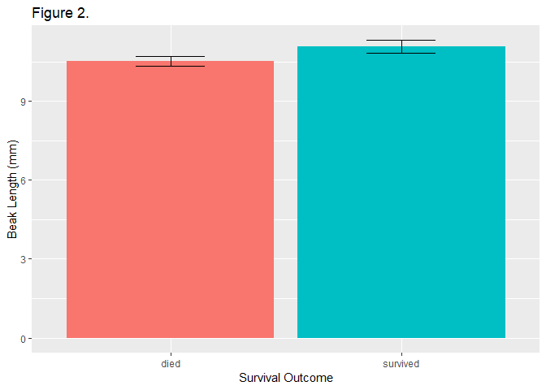

Practicegithub
================

First the libraries must be loaded.

The finches data must be read

``` r
finches <- read_excel("finches_data.xlsx")
```

Look at the data.

``` r
glimpse(finches)
```

    ## Observations: 100
    ## Variables: 12
    ## $ band             <dbl> 9, 12, 276, 278, 283, 288, 293, 294, 298, 307...
    ## $ species          <chr> "Geospiza fortis", "Geospiza fortis", "Geospi...
    ## $ sex              <chr> "unknown", "female", "unknown", "unknown", "m...
    ## $ first_adult_year <dbl> 1975, 1975, 1976, 1976, 1976, 1976, 1976, 197...
    ## $ last_year        <dbl> 1977, 1977, 1977, 1977, 1977, 1977, 1977, 197...
    ## $ outcome          <chr> "died", "died", "died", "died", "died", "died...
    ## $ weight           <dbl> 14.50, 13.50, 16.44, 18.54, 17.44, 16.34, 15....
    ## $ wing             <dbl> 67.00, 66.00, 64.19, 67.19, 70.19, 71.19, 67....
    ## $ tarsus           <dbl> 18.00, 18.30, 18.47, 19.27, 19.27, 20.27, 17....
    ## $ beak_length      <dbl> 9.20, 9.50, 9.93, 11.13, 12.13, 10.63, 9.93, ...
    ## $ beak_depth       <dbl> 8.3, 7.5, 8.0, 10.6, 11.2, 9.1, 9.5, 10.5, 8....
    ## $ beak_width       <dbl> 8.1, 7.5, 7.6, 9.4, 9.5, 8.8, 8.9, 9.1, 8.2, ...

Create a histogram of beak length grouped by survival.

``` r
ggplot(
  data = finches,                     
  mapping = aes(x = beak_length,      
                fill = outcome)       
) +
  geom_histogram(bins = 14) +        
  facet_wrap(~ outcome, ncol = 1) +  
  guides(fill = FALSE) +              
  labs(
    title = "Figure 1.",             
    x = "Beak Length (mm)",           
    y = "Number of Birds"             
  )
```


Summarize the data set by outcome.

``` r
beak_length_grouped_summary <- 
  finches %>% 
  group_by(outcome) %>% 
  summarize(mean = mean(beak_length),
            sd = sd(beak_length),
            n = n()) %>% 
  mutate(sem = sd / sqrt(n),
         upper = mean + 1.96 * sem,
         lower = mean - 1.96 * sem)
```

Create a bar chart.

``` r
ggplot(
  data = beak_length_grouped_summary,   # dont use the original finches dataset
  mapping = aes(x = outcome,            # survival on the x axis
                y = mean,               # mean beak length on the y axis
                fill = outcome)         # make died/survived different colors
) +
  geom_col() +                          # add columns
  geom_errorbar(                        # add error bars
    mapping = aes(ymin = lower,         #   lower 95% confidence limit
                  ymax = upper),        #   upper 95% confidence limit
    width = .3                          #   width of horizontal part of bars
  ) +
  guides(fill = FALSE) +                # don't show a legend for fll color
  labs(
    title = "Figure 2.",                # title
    x = "Survival Outcome",             # x-axis label
    y = "Beak Length (mm)"              # y-axis label
  )
```



Get a vector of beak lengths for birds that died.

``` r
beak_length_died <-
  finches %>%                     # start with finches dataset
  filter(outcome == "died") %>%   # only include rows w/ outcome=died
  pull(beak_length)               # extract the beak_length column
```

Print the new object in the console... it is a vector

``` r
beak_length_died
```

    ##  [1]  9.20  9.50  9.93 11.13 12.13 10.63  9.93 11.33  9.93 11.10 10.80
    ## [12]  9.70 10.60  9.60 10.50  9.90  9.60 10.70  9.30 10.10  9.70 11.00
    ## [23] 11.00 11.60 10.50 10.20  9.70 11.10 11.10 10.20 10.80 10.00 11.10
    ## [34] 10.30 11.10 10.50 11.00 10.00 10.30 11.70 10.20 10.90 11.90 10.20
    ## [45] 10.50 10.50  9.80 11.80 11.00 10.30

Get a vector of beak lengths for birds that survived.

``` r
beak_length_survived <-
  finches %>% 
  filter(outcome == "survived") %>% 
  pull(beak_length)
```

Print the results in the console.

``` r
beak_length_survived
```

    ##  [1] 11.50 10.20 12.10 11.60 10.30 11.40  8.70  9.90 10.20 10.30 11.43
    ## [12] 11.93 11.03 10.63 10.83 11.23 11.23 10.23 11.63 12.23 11.03 11.13
    ## [23] 10.93 11.03 10.23 11.33 10.03 10.70 10.00 12.43 11.09  9.63 11.60
    ## [34] 11.30 12.13 12.03 10.63 11.83 12.43 12.73 10.33 11.03 12.53 12.13
    ## [45] 10.43 10.53 11.23 11.23 10.90 10.50

Perform a two-sample t-test assuming unequal variances.

``` r
t.test(beak_length_died, beak_length_survived)
```

    ## 
    ##  Welch Two Sample t-test
    ## 
    ## data:  beak_length_died and beak_length_survived
    ## t = -3.6335, df = 94.807, p-value = 0.0004539
    ## alternative hypothesis: true difference in means is not equal to 0
    ## 95 percent confidence interval:
    ##  -0.8681443 -0.2546557
    ## sample estimates:
    ## mean of x mean of y 
    ##   10.5122   11.0736
